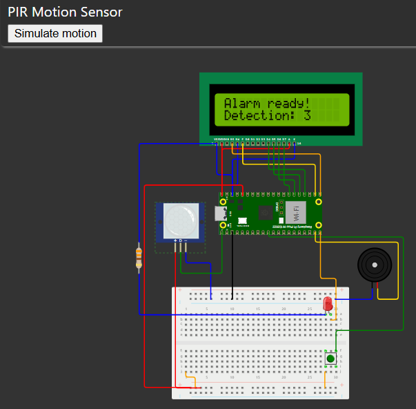

# RapsberryPico
## DIY projects with Raspberry Pi Pico

### List of projects:
 4. Thermostat controler
 3. Intruder detection
 2. Pico Nerd Game
 1. Blinking LED

---
 4. Thermostat controler

 Parts list:

 - PT100 amplifiler MAX31865 EAN: 5904422375911
 - P100 Sensor EAN: 5904422306977
 - Pico Dual Channel Relay HAT  EAN: 5055652921284
 - Pico Dual Expander Waveshare 19343 EAN: 5904422371685
---
 3. Intruder Detection

 Simple application for detecting objects/intruders with use of PIR sensor.
 The code can be tested on WOKWI https://wokwi.com/projects/419243512269148161

 Connection Diagram: 
 ---
 
 ---
 2. Pico Nerd Game

 The code can be tested on WOKWI https://wokwi.com/projects/418430503854160897

 Connection Diagram: 
 ---
 
 ---
 Simple game for testing user knowledge regarding binary representation of numbers.
 In each turn a number (in range up to 255) is randomly selected and printed on the LCD screen. 
 The user task is to switch on LED's that corresponds to high bit values of the current number.

 Note: libraries for LCD controll source: https://www.circuitschools.com/interfacing-16x2-lcd-module-with-raspberry-pi-pico-with-and-without-i2c/ 

---
 1. Blinkin LED
The code can be tested on WOKWI https://wokwi.com/projects/418355273497277441

Connection Diagram:
---
 