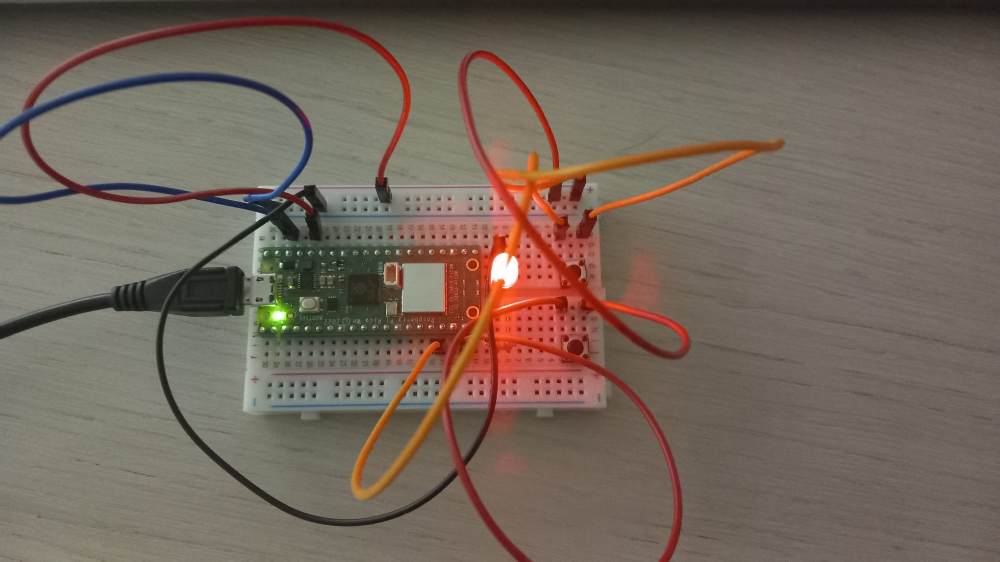
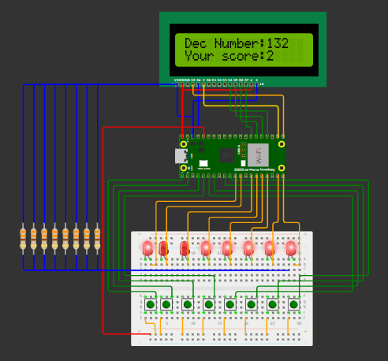

# RapsberryPico
## DIY projects with Raspberry Pi Pico

### List of projects:

 1. Blinking LED
 2. Pico Nerd Game

... TBC

---
 1. Blinkin LED
The code can be tested on WOKWI https://wokwi.com/projects/418355273497277441

Connection Diagram:
---
 

Model tests:
---
 

 ---

 2. Pico Nerd Game

 The code can be tested on WOKWI https://wokwi.com/projects/418430503854160897

 Connection Diagram: 
 ---
 

---
 Simple game for testing user knowledge regarding binary representation of numbers.
 In each turn a number (in range up to 255) is randomly selected and printed on the LCD screen. 
 The user task is to switch on LED's that corresponds to high bit values of the current number.

 Note: libraries for LCD controll source: https://www.circuitschools.com/interfacing-16x2-lcd-module-with-raspberry-pi-pico-with-and-without-i2c/ 

